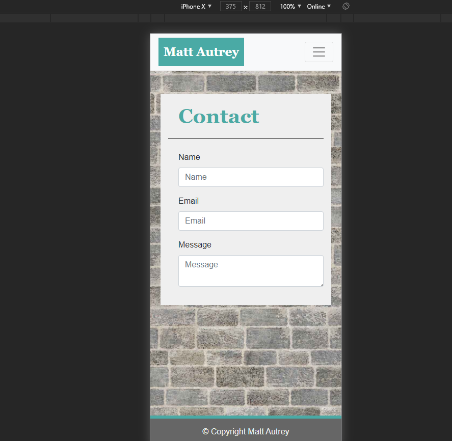
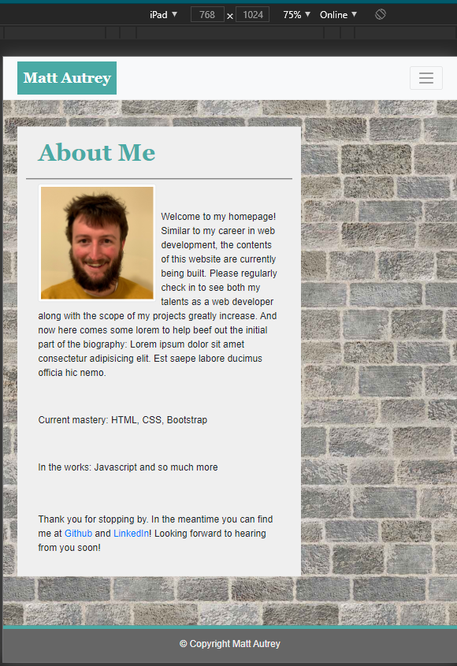
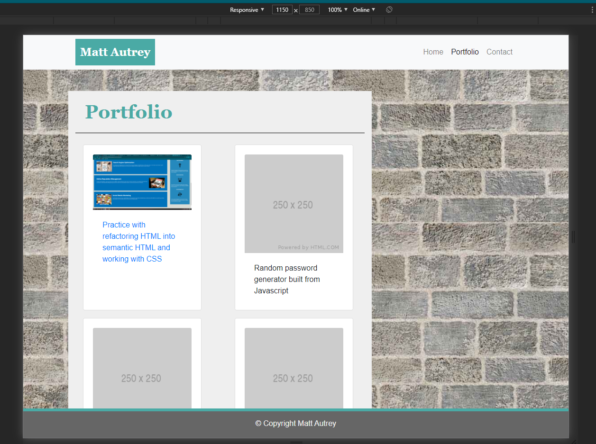

# mautrey17.github.io
My personal website

This website serves as both the location of my portfolio and launch pad for my career into web development. Using a combination of HTML, CSS, and Bootstrap, responsiveness was the goal of this project. The foundation has now been set for what will soon be a career competitive website/portfolio.

Installation: None required

Usage: Follow the link: https://mautrey17.github.io/index.html

